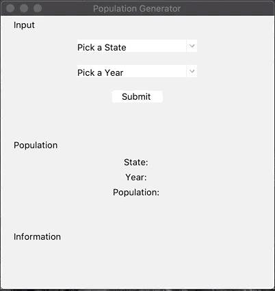

# Population Generator
A microservice that gathers the population size and additional, random information related to a state in a given year.



## About the Project
This project is a microservice that was developed in my Software Engineering I course. Students were tasked with creating a microservice that would communicate with another student's microservice. The course served as an introduction to the software development lifecycle, requirements analysis and specification, design techniques, and project management.

The content generator microservice that this application communicates with can be found here:
https://github.com/mxjeffers/contentcreator

## Package Requirements
* [Tkinter](https://docs.python.org/3/library/tkinter.html)
* [Flask](https://flask.palletsprojects.com/en/1.1.x/)
* [requests](https://requests.readthedocs.io/en/master/)
* [csv](https://docs.python.org/3/library/csv.html)
* [os](https://docs.python.org/3/library/os.html?highlight=os#module-os)
* [sys](https://docs.python.org/3/library/sys.html?highlight=sys#module-sys)

## Launching the Application

To run the population generator from the command line with an input.csv file
```
python populationgenerator.py input.csv
```
To run the population generator as a GUI
```
python populationgenerator.py
```
To allow other microservices to communicate with the population generator
```
python server.py
```
